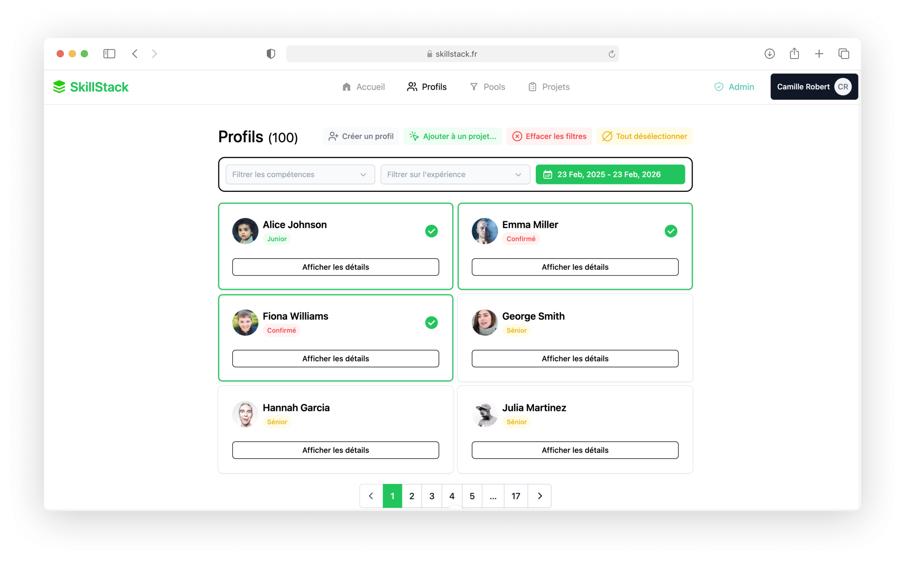
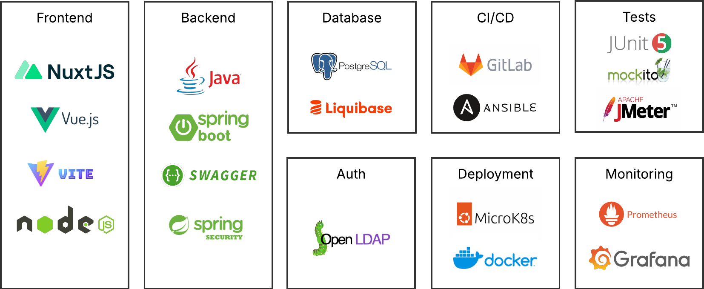
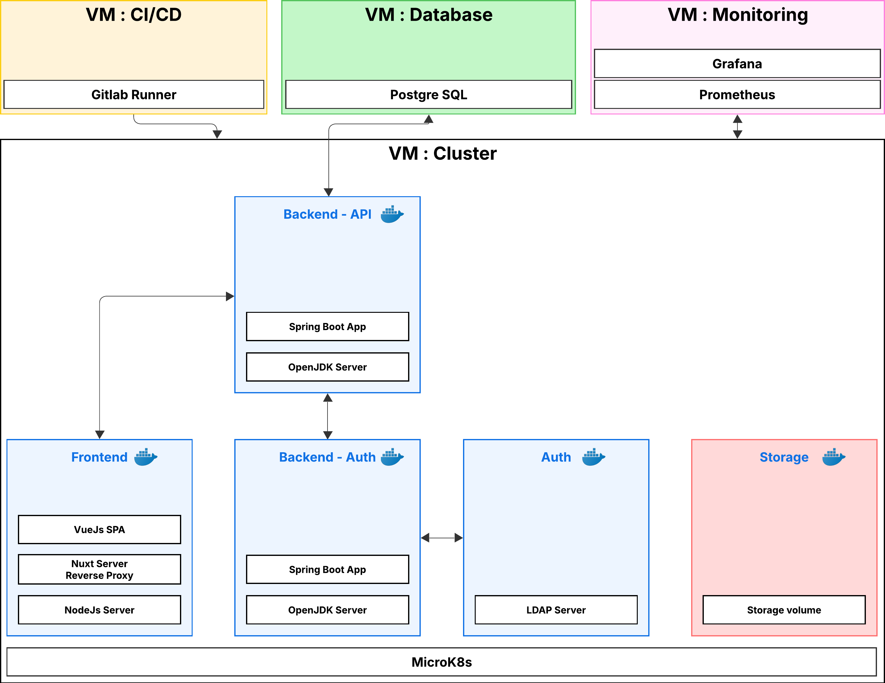

# **HACKATHON ISTIC 2025**  
### **Application de réservation de ressources humaines**  

  

### **Équipe**  
- Alexandre Boutinaud
- Gaetan Peron
- Vladislav Buraga 
- Yasser El Mellali
- Asmaa Nazih
- Huu Anh Nguyen
- Pierre Edouard Hermenier
- Meryem Berkaoui
- Zidane Ben Lamlih

## **Introduction**
Ce projet a été réalisé dans le cadre du Hackathon de l'ISTIC en 2025. L’objectif était de concevoir une application de réservation de ressources humaines pour une entreprise de développement logiciel en une semaine.

Dans une grande entreprise de développement logiciel, il est souvent difficile d’identifier rapidement les employés disponibles et compétents pour intégrer un projet. Cette application vise à résoudre ce problème en proposant une plateforme intuitive permettant :  
✅ La recherche d’employés selon leurs compétences et leur disponibilité.  
✅ Un système de réservation et d’affectation aux projets.  
✅ Une interface ergonomique pour gérer les profils des employés.  

## **Architecture & Technologies**  
L’architecture de notre projet a été pensée pour se rapprocher d’un environnement de production réel.  

### **Technologies utilisées**  
- **Frontend :** Vue.js, Nuxt, TypeScript, Nuxt UI  
- **Backend :** Spring Boot, API REST  
- **Base de données :** PostgreSQL, Liquibase  
- **Authentification :** LDAP  
- **Déploiement :** Kubernetes (MicroK8s), Ansible, GitLab CI/CD  
- **Monitoring :** Grafana, Prometheus



## **Base de données**
La base de données PostgreSQL est utilisée pour stocker les informations des employés et des projets.


## **Infrastructure & Déploiement**  
L’application repose sur une infrastructure modulaire et scalable.  

- **3 machines virtuelles dédiées :**  
  - **VM1** : GitLab Runner  
  - **VM2** : Base de données PostgreSQL  
  - **VM3** : Cluster Kubernetes (MicroK8s) exécutant les services  
- **Orchestration :**  
  - Conteneurisation avec Docker  
  - Déploiement automatisé avec Ansible  
  - CI/CD avec GitLab  

  

## **Frontend**  
- **Framework :** Vue.js avec Nuxt  
- **Styling :** Nuxt UI  
- **Optimisation :** Développement de composants réutilisables, code review systématique, intégration continue.  

## **Backend**  
- **Framework :** Spring Boot  
- **Sécurité & Authentification :** Gestion via LDAP  
- **Base de données :** PostgreSQL avec versioning sous Liquibase  
- **API REST :** Exposition des endpoints pour la gestion des utilisateurs et des projets.  

## **Montée en charge & Monitoring**  
- **Tests de charge :** Utilisation d’outils comme JMeter et k6  
- **Monitoring :**  
  - **Prometheus** : collecte des métriques système et applicatives  
  - **Grafana** : visualisation et alerting  

## **Organisation & Collaboration**  
Notre équipe a adopté une méthodologie Agile pour assurer une répartition efficace du travail.  

- **Communication :** Daily meetings pour synchroniser l’équipe.  
- **Gestion des tâches :** Board GitLab, Pull Requests et revue de code.  
- **Avancement parallèle :** Utilisation de conteneurs et d’environnements virtualisés pour éviter les blocages.  

## **Conclusions & Retours d'expérience**  

### **Points forts**  
✔️ Répartition efficace des rôles selon les compétences de chacun.  
✔️ Travail en parallèle grâce à la conteneurisation et aux outils collaboratifs.  
✔️ Mise en place d’une architecture modulaire et proche d’une infrastructure de production.  
✔️ Utilisation des technologies enseignées en cours et rencontrées en entreprise.  

### **Points faibles & améliorations possibles**  
❌ Certaines décisions techniques ont nécessité plus de temps que prévu.  
❌ Infrastructure longue à mettre en place, demandant plus d’anticipation.  
❌ Difficultés dans la synchronisation entre certaines sous-parties de l’équipe.  

## **Comment exécuter l’application sur votre machine ?**  

### **Prérequis**  
- Docker & Docker Compose

### **Lancer l’application en local**  
```bash
docker-compose up -d
```

## 📧 **Contact & Contributions**  
Pour toute question ou suggestion, n’hésitez pas à nous contacter.